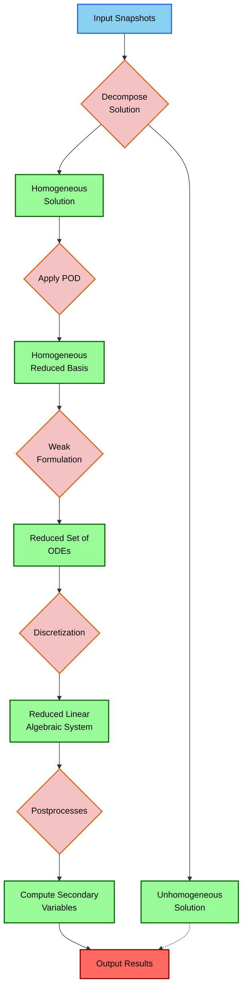
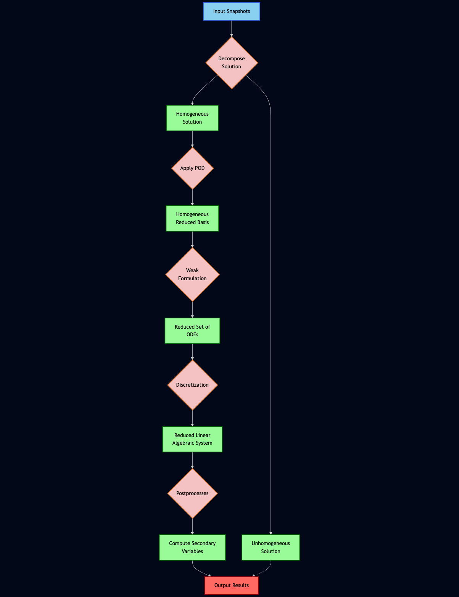

# Legacy Charts to Mermaid with GenAI

**Session Date:** December 8, 2025  
**Course:** From Prompt to Prototype  
**Topic:** Converting Legacy Diagrams to Editable Mermaid Charts

## Overview

In this session, we explored how generative AI can convert legacy static images into editable, embeddable Mermaid diagrams. We compared two leading AI models—ChatGPT 5.1 and Gemini 3—using the same input image and prompt to evaluate their diagram interpretation and code generation capabilities.

## What We Built

- Converted a legacy flowchart image to Mermaid syntax
- Created an interactive, editable diagram using Mermaid Live
- Compared AI model performance on technical diagram interpretation
- Generated embeddable code for web integration

## Key Concepts

### Why Mermaid?

Mermaid is a JavaScript-based diagramming tool that renders text definitions into diagrams. Benefits include:

- **Version control friendly**: Diagrams are stored as code, not binary images
- **Editable**: Changes are made by editing text, not manipulating graphics
- **Embeddable**: Works natively in GitHub, GitLab, Notion, and most documentation platforms
- **Consistent styling**: CSS-based themes ensure visual consistency

### Legacy Chart Problems

Traditional diagram images (PNG, JPG, PDF) present challenges:

- Cannot be edited without original source files
- Difficult to maintain consistency across versions
- Not searchable or accessible
- Large file sizes compared to text-based alternatives

### AI Model Comparison

We tested both models with identical inputs:

| Aspect | ChatGPT 5.1 | Gemini 3 |
|--------|-------------|----------|
| Speed | Moderate | Faster |
| Accuracy | Good | Better |
| Code quality | Functional | Cleaner syntax |
| Style interpretation | Basic | More detailed |

Gemini 3 demonstrated faster processing and more accurate interpretation of the flowchart structure, particularly in handling the branching logic and node styling.

## Input

The original legacy chart used as input:


## Output

The generated Mermaid diagram:

[![Mermaid Diagram](https://mermaid.ink/img/pako:eNqVVdtum0AQ_ZXVRnmzXW7GQKtIsQlqpbaJ4l6k2n1Yw9heGXbR7tLEQf73rsEG4jZO6wfMrOacM8wchhLHPAEc4GXKH-I1EQp9CecM6d_lJQphSRmgqdqmIFEhKVshgu4IU5xBnzKZUwEJykkKSkENi1MipQYiyvJCfdbsaEnTNLjw_EkUGT2pBN9AcGGNXSO8OYT9B5qodWDlj72Yp1wEi5TEm7cnjCRWlLMOZeRMrInVUIaW65vnKXtyTXIIEkoyzpJTAQGySLs1-1409r1GwDBcxzD-q2ZeqOdtiCLXd82G0hsbxuuUzUT2RLKOPuz7O6uuaMpILtdcyZ9BEDSNr_Nuqwpm9R-6rx6xymtL6whMFeTIrMP9vVmGEPMs5xLeLcSbqylPi_0UdpqgnUedr7lNMvvK1jzjK2DAC_kMsxdtW9xiFrP3_4h4XqbVlmmV13mebtHdbfhCZdYfIveQFLG275hIKs8r2a2SXX4HsqkIIi6yIiVn2mHPjiJTUIgvK9htePOKnNPKOWVIZSxA0adzQk4j9FG_sURUQtfpChaC0BhNt1JBdl502IoOyzsuVS54DFKCfEFzOJtoYxRKLwhtEZYQsa1kvxFByUJvjBf1JpwxqAgl6h8qRpHeQB1no37_qnZgfdhZSgc_IpmnVEm9aBRH6oH30ELDOlNGiaC_9OJSa0AMHhXSTcg71q4kKtP-7XDR1a0OmpK6xjvmW63TmryubY55dmuOJq8772Oe0862yeuO6Jg3PGlPRBlJDy99O6oq--TQJKg_aI5xD68ETXCgRAE9nIHIyD7E5R4wx7qJGcxxoG_1pDdzPGc7jckJ-8F5doQJXqzWOFiSVOqoyBOiIKRkJUjWnJJC8emWxUcMJFRx8an-DlWfI80DLAEx4QVTODB9b1Qp4aDEj_vYGnijoWHrdWx5ntnDWxzY9sBwXXtkOUPXMlzPdXY9_FSVZgx82xgNHd80Tc92PMff_QaeMkEO?type=png)](https://mermaid.live/edit#pako:eNqVVdtum0AQ_ZXVRnmzXW7GQKtIsQlqpbaJ4l6k2n1Yw9heGXbR7tLEQf73rsEG4jZO6wfMrOacM8wchhLHPAEc4GXKH-I1EQp9CecM6d_lJQphSRmgqdqmIFEhKVshgu4IU5xBnzKZUwEJykkKSkENi1MipQYiyvJCfdbsaEnTNLjw_EkUGT2pBN9AcGGNXSO8OYT9B5qodWDlj72Yp1wEi5TEm7cnjCRWlLMOZeRMrInVUIaW65vnKXtyTXIIEkoyzpJTAQGySLs1-1409r1GwDBcxzD-q2ZeqOdtiCLXd82G0hsbxuuUzUT2RLKOPuz7O6uuaMpILtdcyZ9BEDSNr_Nuqwpm9R-6rx6xymtL6whMFeTIrMP9vVmGEPMs5xLeLcSbqylPi_0UdpqgnUedr7lNMvvK1jzjK2DAC_kMsxdtW9xiFrP3_4h4XqbVlmmV13mebtHdbfhCZdYfIveQFLG275hIKs8r2a2SXX4HsqkIIi6yIiVn2mHPjiJTUIgvK9htePOKnNPKOWVIZSxA0adzQk4j9FG_sURUQtfpChaC0BhNt1JBdl502IoOyzsuVS54DFKCfEFzOJtoYxRKLwhtEZYQsa1kvxFByUJvjBf1JpwxqAgl6h8qRpHeQB1no37_qnZgfdhZSgc_IpmnVEm9aBRH6oH30ELDOlNGiaC_9OJSa0AMHhXSTcg71q4kKtP-7XDR1a0OmpK6xjvmW63TmryubY55dmuOJq8772Oe0862yeuO6Jg3PGlPRBlJDy99O6oq--TQJKg_aI5xD68ETXCgRAE9nIHIyD7E5R4wx7qJGcxxoG_1pDdzPGc7jckJ-8F5doQJXqzWOFiSVOqoyBOiIKRkJUjWnJJC8emWxUcMJFRx8an-DlWfI80DLAEx4QVTODB9b1Qp4aDEj_vYGnijoWHrdWx5ntnDWxzY9sBwXXtkOUPXMlzPdXY9_FSVZgx82xgNHd80Tc92PMff_QaeMkEO)

*Click the diagram to open in Mermaid Live Editor*

## Mermaid Code

The complete Mermaid source code:



## How to Use

### Embedding in GitHub/GitLab

Simply paste the code above into a markdown file with triple backticks and the `mermaid` language identifier. Most Git platforms render Mermaid natively.

### Embedding in HTML

Use the Mermaid.js library:

```html
<script type="module">
  import mermaid from 'https://cdn.jsdelivr.net/npm/mermaid@10/dist/mermaid.esm.min.mjs';
  mermaid.initialize({ startOnLoad: true });
</script>

<pre class="mermaid">
  <!-- paste mermaid code here -->
</pre>
```

### Using Mermaid Live

Visit [mermaid.live](https://mermaid.live) to:
- Edit diagrams in real-time
- Export as PNG, SVG, or embed links
- Share editable versions with collaborators

## Resources

- [Mermaid Documentation](https://mermaid.js.org/intro/)
- [Mermaid Live Editor](https://mermaid.live)
- [GitHub Mermaid Support](https://github.blog/2022-02-14-include-diagrams-markdown-files-mermaid/)

---

## Session Outcome

Side-by-side comparison of the legacy chart and generated Mermaid diagram:

| Legacy Chart | Mermaid Output |
|--------------|----------------|
|  |  |

---

<div align="center">

**[← Back to Course Home](../README.md)**

*Part of the "From Prompt to Prototype" series*  
*University of Oxford | Digital Capabilities*

---

[](https://creativecommons.org/licenses/by-nc-sa/4.0/)

This work is licensed under a [Creative Commons Attribution-NonCommercial-ShareAlike 4.0 International License](https://creativecommons.org/licenses/by-nc-sa/4.0/).

</div>


