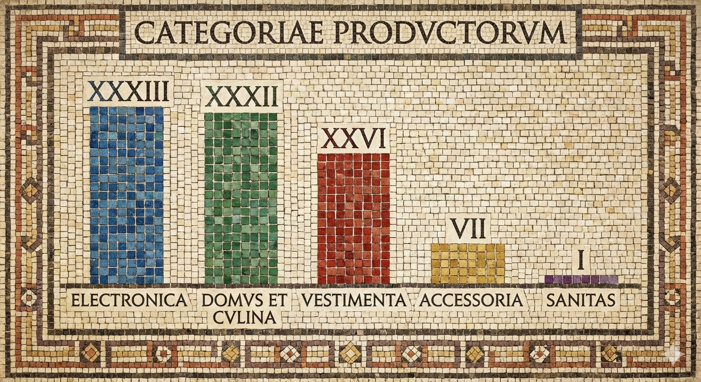

# Google Gemini: LaTeX, Charts, and Web Apps

**Session Date:** December 15, 2025  
**Course:** From Prompt to Prototype  
**Topic:** Handwritten Equations to LaTeX, Data Visualisation, and PDF Viewer Web App

## Overview

In this session, we explored the capabilities of Google Gemini across three distinct use cases: converting handwritten mathematical notes to publication-ready LaTeX, generating data visualisations from CSV files, and building a fully functional PDF viewer web application with light and dark modes.

## What We Built

- Converted handwritten mathematical equations (including Navier-Stokes) to LaTeX
- Generated charts from CSV data using Python code execution within Gemini
- Created artistic data visualisations as images
- Built a PDF viewer web app with light/dark mode toggle
- Received deployment instructions for cloud hosting

## Key Concepts

### Handwritten Equations to LaTeX

The most impressive demonstration was converting messy handwritten notes with complex equations into clean LaTeX. Unlike traditional OCR (Optical Character Recognition) systems that match individual characters, LLMs can "reason" about the mathematical context, correcting errors and producing accurate output even when the handwriting is imperfect.

**Example: Navier-Stokes Equation**

The handwritten notes included the Navier-Stokes equation in index notation:

$$\rho U_{i,t} + \rho U_{k} U_{i,k} = -P_{,i} + \mu U_{i,jj} + f_{i}$$

```latex
\rho U_{i,t} + \rho U_{k} U_{i,k} = -P_{,i} + \mu U_{i,jj} + f_{i}
```

Gemini correctly identified and transcribed this equation on the first attempt, demonstrating its understanding of:
- Index notation conventions
- Comma notation for derivatives
- Physical context of fluid dynamics equations

### Why LLMs Outperform Traditional OCR

| Traditional OCR | LLM-Based Conversion |
|-----------------|---------------------|
| Character-by-character matching | Contextual understanding |
| Struggles with subscripts/superscripts | Handles mathematical notation natively |
| No error correction capability | Can reason about and fix mistakes |
| Limited to recognised glyphs | Understands mathematical semantics |

### Data Visualisation from CSV

Gemini demonstrated two approaches to creating charts from tabular data:

1. **Code Execution**: Gemini can write and execute Python code (matplotlib, pandas) directly within the app, producing standard data visualisations
2. **Creative Image Generation**: Gemini can generate artistic interpretations of data as images

The creative approach produced a Roman mosaic-style visualisation of the dataset:



*Data represented as a classical mosaic, demonstrating Gemini's ability to merge data with artistic style*

### PDF Viewer Web Application

Using Gemini's code generation capabilities, we built a complete PDF viewer web application featuring:

- File upload functionality
- PDF rendering and navigation
- Light and dark mode toggle
- Responsive design
- Deployment-ready code with cloud hosting instructions

## Tools Used

- **Google Gemini** - Multimodal AI for text, code, and image generation
- **Python** (via Gemini code execution) - Data visualisation
- **HTML/CSS/JavaScript** - PDF viewer web app

## Use Cases

### Academic Publishing
- Convert lecture notes to LaTeX for papers
- Digitise handwritten derivations
- Create publication-ready equations from whiteboard photos

### Data Communication
- Generate charts for presentations
- Create artistic data visualisations for reports
- Transform spreadsheets into visual narratives

### Rapid Prototyping
- Build functional web apps in minutes
- Get deployment instructions alongside code
- Iterate on designs through conversation

## Resources

- [Google Gemini](https://gemini.google.com/)
- [LaTeX Mathematical Notation](https://www.overleaf.com/learn/latex/Mathematical_expressions)
- [Navier-Stokes Equations](https://en.wikipedia.org/wiki/Navier%E2%80%93Stokes_equations)

---

## Session Outcome

PDF viewer web application with light and dark mode:


*Gemini generated the complete application and provided cloud deployment instructions*

---

<div align="center">

**[← Back to Course Home](../README.md)**

*Part of the "From Prompt to Prototype" series*  
*Mattia Montanari | University of Oxford | Digital Capabilities*

---

[](https://creativecommons.org/licenses/by-nc-sa/4.0/)

This work is licensed under a [Creative Commons Attribution-NonCommercial-ShareAlike 4.0 International License](https://creativecommons.org/licenses/by-nc-sa/4.0/).

</div>

