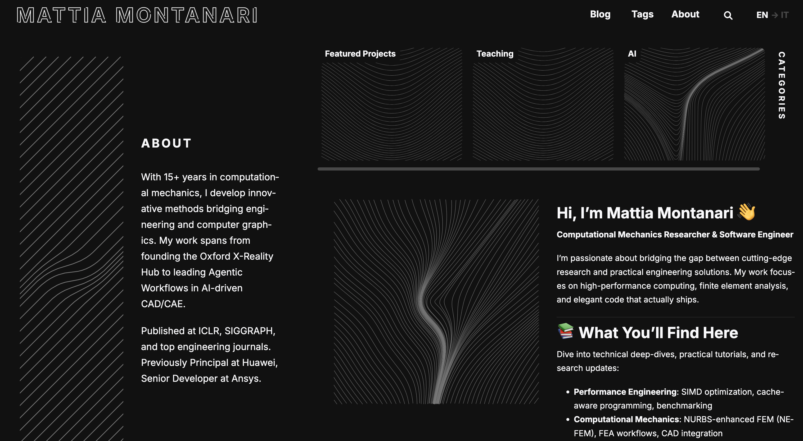

# From Prompt to Prototype: A 60 Minute AI Experiment

[](https://skills.it.ox.ac.uk/whats-on#/course/OXFORDXU4U/WS074)

## About This Course

This course explores the process of building functional prototypes in one hour using AI tools. Each session moves from initial concept to working implementation through live coding, demonstrating practical approaches to AI-assisted development.

The format is unscripted and experimental, showing real-time decision-making, problem-solving, and the practical constraints of working with AI tools. Sessions cover different technologies and use cases, providing insight into how AI can accelerate the development process.

The course is designed for educators, developers, and anyone interested in understanding how AI tools can be applied to practical building projects.

---

## Course Sessions

| Date | Topic | Description | Demo |
|------|-------|-------------|------|
| **2025-12-01** | [LLMs vs Agents](2025-12-01/README.md) | Built a functional AI agent with memory, file system tools, and autonomous decision-making |  |
| **2025-11-24** | [Building with Hugo](2025-11-24/README.md) | Migrated a personal website to Hugo with automatic multilingual content generation |  |

---

### Course Details

- **Format:** Online taught course (via Microsoft Teams)
- **Duration:** 60 minutes
- **Level:** Beginner
- **Audience:** Open to all members of the University
- **Provider:** Digital Capabilities, IT Services, University of Oxford
- **Fee:** Free for students and postgrads

### Learning Objectives

- Observe how AI tools can be used in real-world creative building
- Recognise reliable versus immature or unstable AI technologies
- Assess the practical costs and trade-offs of using AI tools
- Manage expectations when starting or scaling AI-driven projects
- Reflect on future possibilities of fast, low-cost digital creation
- Experience live learning through the teacher's unscripted exploration

### Digital Capabilities Covered

- Digital creation, problem solving and innovation
- Digital learning and development

---

## Course Registration

Register for upcoming sessions:

[Register on Oxford Skills Portal](https://skills.it.ox.ac.uk/whats-on#/course/OXFORDXU4U/WS074)

---

## Session Materials

Each session folder contains:
- `README.md` - Detailed guide and documentation
- Complete source code
- Demo GIFs and screenshots
- Setup instructions and prerequisites

Browse the session folders above to explore the materials from each week.

---

## Prerequisites

**Prior Knowledge:** Basic familiarity with digital skills — ranging from software development to design — applied to create or build a product or solution.

**What You'll Need:**
- No student computer activity required during the live sessions
- For hands-on practice with materials: basic terminal/command line knowledge helpful
- Curiosity and willingness to embrace the unpredictable


---

## Repository Structure

```
ox-prompt-to-prototype-series/
├── README.md                 # This file - course landing page
├── 2025-11-24/              # Week 1: Hugo Static Sites
│   ├── README.md
│   └── lesson/
├── 2025-12-01/              # Week 2: LLMs vs Agents
│   ├── README.md
│   ├── agent.py
│   ├── server.py
│   └── lesson/
└── [future sessions]/
```

---

## Connect & Learn More

- [About the instructor](https://www.mattiamontanari.com)
- [Oxford Digital Capabilities](https://skills.it.ox.ac.uk/)
- [Contact Digital Capabilities Team](https://skills.it.ox.ac.uk/contact)
- [Explore More Digital Skills Courses](https://skills.it.ox.ac.uk/)

---

## License

<div align="center">

[](https://creativecommons.org/licenses/by-nc-sa/4.0/)

This work is licensed under a [Creative Commons Attribution-NonCommercial-ShareAlike 4.0 International License](https://creativecommons.org/licenses/by-nc-sa/4.0/).

**University of Oxford** | IT Services | Digital Capabilities

</div>
